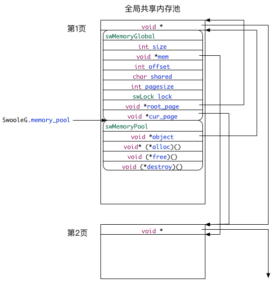

# 全局共享内存池

全局共享内存池涉及到2个数据结构和4个函数。

* 2个数据结构：[swMemoryGlobal][swMemoryGlobal]、[swMemoryPool][swMemoryPool]。其中[swMemoryGlobal][swMemoryGlobal]保存全局共享内存池的meta信息；[swMemoryPool][swMemoryPool]包含全局共享内存的地址以及内存管理的相关方法。

* 4个函数：`swMemoryGlobal_new`、`swMemoryGlobal_new_page`、`swMemoryGlobal_alloc`、`swMemoryGlobal_destroy`和`swMemoryGlobal_free`。`swMemoryGlobal_new`用于初始化；`swMemoryGlobal_new_page`用于当内存池不够用时，向操作系统申请内存扩容；`swMemoryGlobal_alloc`用于从内存池申请新内存；`swMemoryGlobal_destroy`用于回收内存；`swMemoryGlobal_free`是空函数。

为了提高性能，swoole采用了预分配的机制，也就是说在实际申请内存空间时，是从预先分配好的内存里取出一段，而不是真的去申请一块新内存。当预分配的内存空间不够时，再向操作系统共享内存申请一整页新内存，大小等于操作系统内存分页。内存页采用单向链表结构，每页的开头8个字节就是链表指针，指向下一页地址，为了方便说明，后面用`next`表示。接下来是实际可分配的内存空间，用`data`表示。

上图展示了全局共享内存池在内存的分配情况。

## 初始化
在模块启动初始化时`swoole_init`会调用`swMemoryGlobal_new`初始化全局共享内存池。

`swMemoryGlobal_new`调用`swMemoryGlobal_new_page`从共享内存申请分配第1页内存，链指针为`NULL`。第1页内存首先依次存放`swMemoryGlobal`和`swMemoryPool`的实例化对象。这两个对象负责管理全局共享内存池。也就是说负责管理全局共享内存池的对象本身也是存放在全局共享内存池里，并且固定地存放在第1页的开头。

`swMemoryGlobal`保存全局共享内存池的meta信息。`size`是内存页的`data`段的大小，即`pagesize - sizeof(void*)`。`mem`是指向当前内存页的`data`段的指针。`offset`是当前内存页已分配内存的大小。`mem + offset`就是未分配内存的起始地址。`shared`标识是否从共享内存申请新内存空间。`pagesize`是内存页大小。`lock`是用于申请新内存的互斥锁。`root_page`是指向第1页的指针。`cur_page`是指向当前页的指针。

`swMemoryPool`包含全局共享内存的地址以及内存管理的相关方法。`object`是指向`swMemoryGlobal`对象的指针。`alloc`是指向`swMemoryGlobal_alloc`的函数指针。`free`是指向`swMemoryGlobal_destroy`的函数指针。`destroy`是指向`swMemoryGlobal_free`的函数指针。

最后全局变量`SwooleG`的成员变量`memory_pool`指向`swMemoryPool`的实例化对象，swoole正式通过这个指针来从全局共享内存池申请分配内存。

## 分配内存
从全局共享内存池申请分配内存需要调用`swMemoryGlobal_alloc`，参数是`SwooleG. memory_pool`和申请的内存的大小。

如果申请的内存超过`pagesize`内存页大小，无法从内存池获得足够大的连续的内存，因此会失败，返回`NULL`。

如果申请的内存超过当前页`cur_page`剩余的内存，就会调用`swMemoryGlobal_new_page`。`swMemoryGlobal_new_page`首先从共享内存申请新的内存页，把新内存页的`link`赋值为`NULL`，然后修改`swMemoryGlobal`，重置`offset`为0，`mem`指向新内存页的`data`段。再把当前页`cur_page`的`link`指向新内存页，把表示当前页的指针`cur_page`指向新内存页。至此完成向内存页链表增加新内存页的操作。

如果当前页`cur_page`剩余的内存足够，那么分配的内存地址是`mem + offset`，修改已分配内存的大小`offset`。

## 小结
从上面的分析可以看出，swoole为了减少从操作系统分配内存的性能消耗，会从操作系统共享内存申请一大块内存备用，然后每次需要新内存的时候，再从内存池分配。内存页间采用单向链表结构，内存页内采用顺序表结构，`link`是内存页链表的指针，`offset`是页内顺序表的偏移量。

[swMemoryGlobal]: ./数据结构.md#swMemoryGlobal
[swMemoryPool]: ./数据结构.md#swMemoryPool